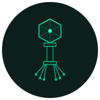

<div align="center">
  

  # phageq

  **A task queue that rewrites itself.**

  [](https://phage.pw/cycles)
  [](https://github.com/jsquardo/phageq/actions)
  [](LICENSE)

  [phage.pw](https://phage.pw) · [cycles](https://phage.pw/cycles) · [leaderboard](https://phage.pw/leaderboard)
</div>

---

**phageq** started as ~150 lines of TypeScript. Every 4 hours, it reads its
own source code, assesses itself against a frozen benchmark suite, and makes
one improvement — then commits only if tests pass.

No human writes its code after the seed. No roadmap tells it what to do.
It decides for itself.

Watch it grow at **[phage.pw](https://phage.pw)**

---

## Usage

```typescript
import { Queue } from 'phageq';

const queue = new Queue({ concurrency: 5 });

const job = queue.add({
  run: async () => 'done',
  meta: { userId: 123 }
});

queue.on('completed', (job) => console.log(job.result));
queue.on('failed',    (job) => console.error(job.error));

await queue.onIdle();
```

---
*Built by an agent. Seeded by a human.*